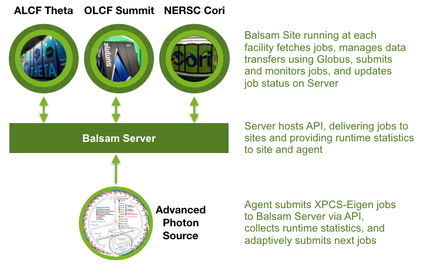

Cross-facility Analysis with XPCS
=================================

X-ray Photon Correlation Spectroscopy (XPCS) is a method used at Department of Energy light sources to measure temporal changes in samples by analyzing speckle patterns using autocorrelation, with single-sample experiments involving repeated collection of megapixel frames at rates of 60 Hz, increasing to tens of kilohertz in the future. As with all light source experiments, beam time is very valuable and emphasizes the importance of efficiency at experiment time; for this reason, real-time or near real-time analysis is essential today and even moreso with future detectors. This implies a need for fast access to DOE computing facilities while data is taken at the light sources, requiring the ability to direct jobs to the most available and appropriate facility for a job, which might be determined by software or hardware availability, or planned and unplanned downtimes at compute facilities.

Balsam
------
Balsam has been developed at ALCF since 2013, when it was first conceived to link high energy physics workflows for the LHC with Argonne's Mira supercomputer. The latest version of Balsam consists of a central server, reachable via a REST API, and user-deployable Balsam `Sites` which communicate with the server to obtain jobs and interact with the local scheduler to run jobs, monitor their status, and synchronize progress with the server. While the single server maintains all job state, Sites are deployed by users on computing resources where they have accounts, minimizing the barrier to entry and providing a user a global view of their available computing. Due to its modular design, Balsam can easily adapt to new systems, and currently includes support for multiple systems at ALCF, Summit at OLCF, and Cori and Perlmutter at NERSC. More information about Balsam is available on the `documentation site <https://balsam.readthedocs.io/en/latest/>`_.

Cross-facility Workflow
-----------------------
In anticipation of the need of experimentalists to direct their workflows to individual facilities, we constructed a series of test scenarios using `XPCS-Eigen <https://github.com/AdvancedPhotonSource/xpcs-eigen>`_ and a proxy application, modeling real-world experiment-time analysis. Balsam uses a central server for managing jobs; using the Python API, we programmatically injected XPCS jobs of varying sizes, and job for the proxy application. To enable these jobs to be run at the three DOE computing facilities, we set up a Balsam Site on each of Theta at ALCF, Summit at OLCF, and Cori at NERSC. Balsam Sites periodically communicate with the main Balsam Server to obtain job lists, stage in necessary input datasets, work with the local job scheduler to submit and monitor jobs through their lifetime on the machine, and transfer output datasets to the specified destination, in this case at the Advanced Photon Source (APS). When individual jobs have run to completion, the Site updates the job status on the main Balsam server. This process of injecting jobs from the APS continued over a period of time, scheduling jobs simultaneously at each of ALCF, OLCF, and NERSC. Throughout the experiment, the APS agent that was submitting jobs queried the Balsam server for job throughput at each compute facility, and adaptively directed the flow of jobs to the site that was achieving the highest throughput.

Full details of these experiments, including throughput metrics, data staging optimization, and fault tolerance tests are available in the `preprint <https://arxiv.org/pdf/2105.06571.pdf>`_, *Toward Real-Time Analysis of Experimental Science Workloads on Geographically Distributed Supercomputers*, Salim et al.
